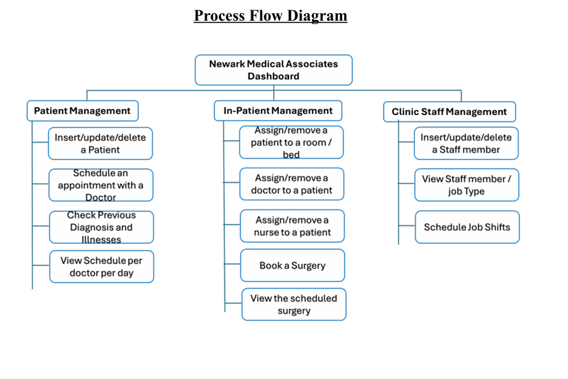

# Final Project Report:
You can read the full project report [here](./CS631-Project.pdf).
## Process Flow Diagram 

## Summery
This report outlines the design and implementation of a comprehensive hospital management system for Newark Medical Associates.

The system comprises three integrated web-based applications, each focused on a specific area:

- Patient management

- In-patient management

- Clinic staff management

Key objectives of the system include:

- Streamlining daily hospital operations

- Improving patient care coordination

- Optimizing resource allocation

A unified database system supports all three applications, ensuring:

- Data consistency across departments

- Efficient and secure access for different stakeholders

The architecture divides functionality into specialized interfaces for distinct user groups while maintaining seamless integration.

This design meets the full application requirements of Newark Medical Associates, providing a scalable and maintainable solution for hospital management.

LINK TO FINAL CODE:https://github.com/hnp36/DataManagment/tree/finalproject
